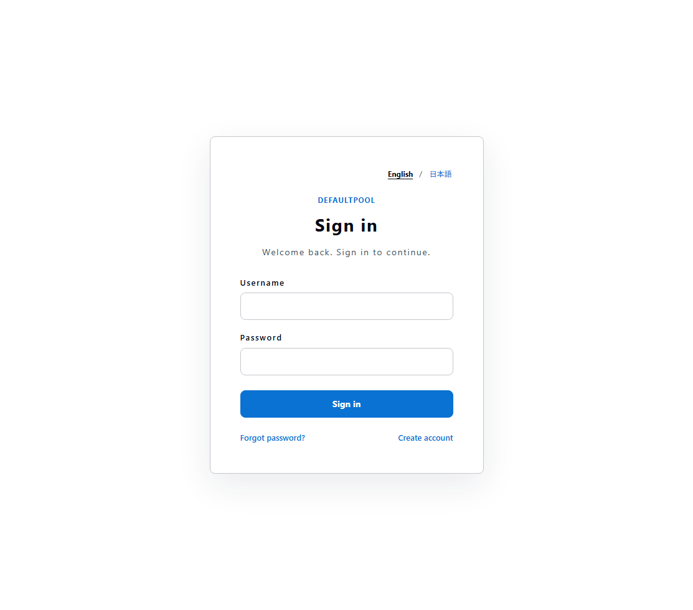
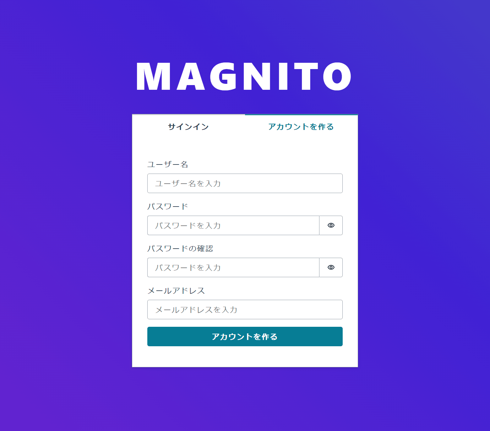
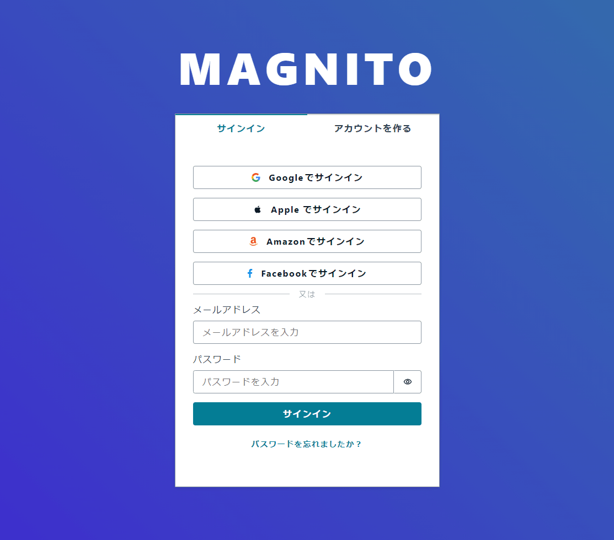
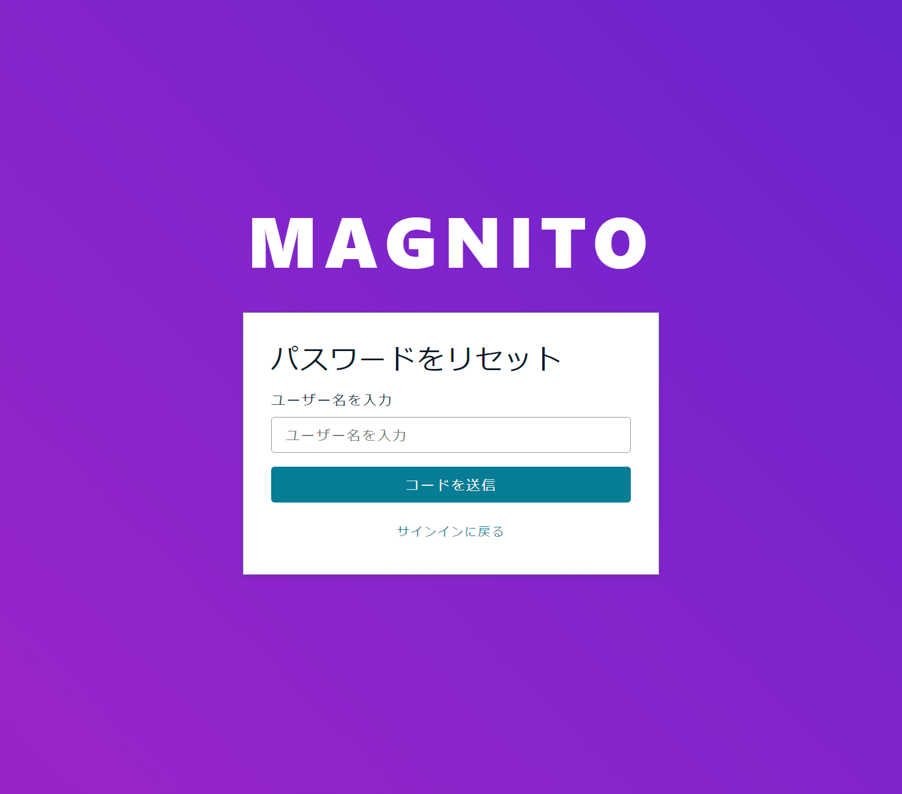
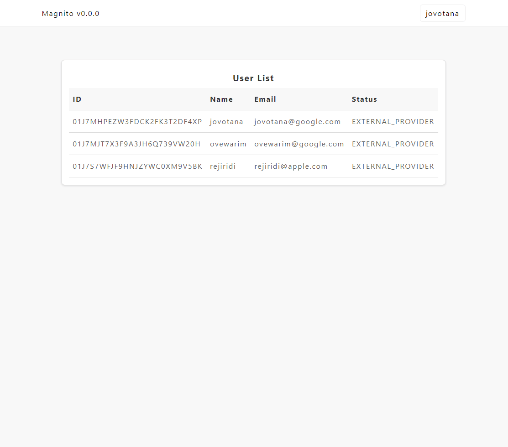
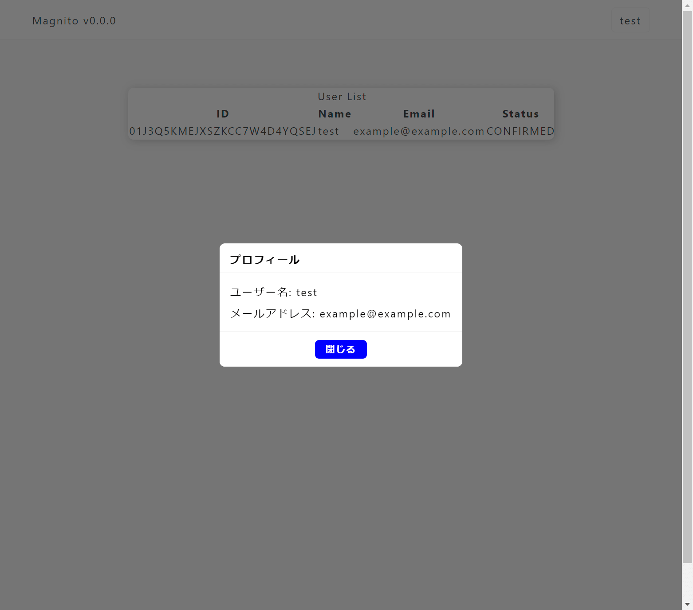
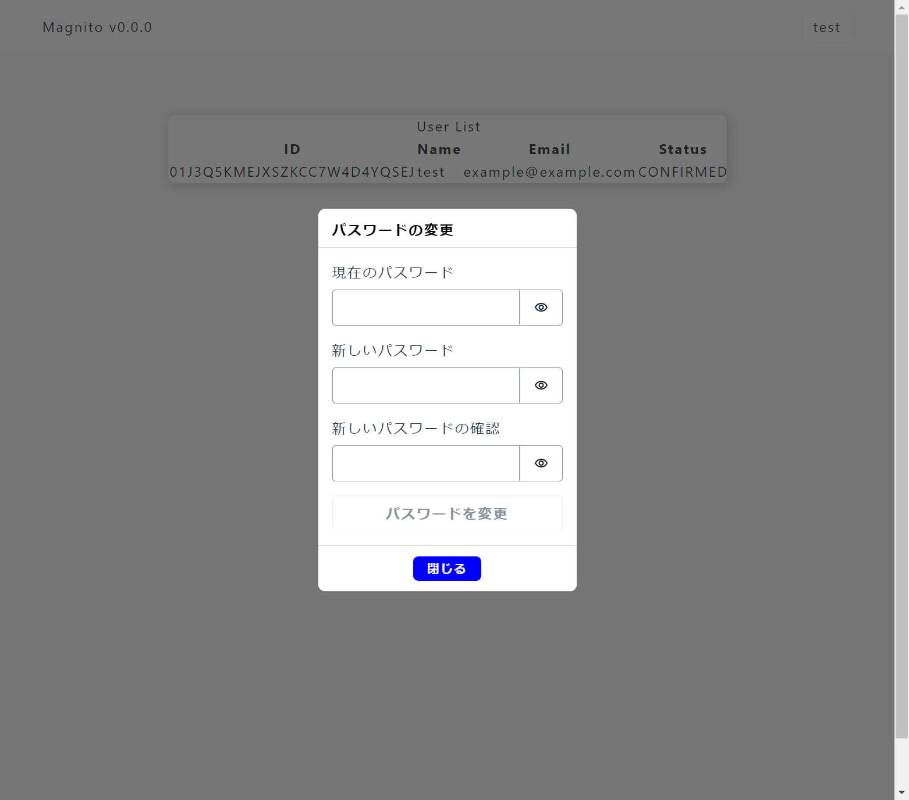

# Magnito

<picture>
  <source media="(prefers-color-scheme: dark)" srcset="https://frourios.github.io/magnito/logos/icon-text-dark.svg">
  <source media="(prefers-color-scheme: light)" srcset="https://frourios.github.io/magnito/logos/icon-text-light.svg">
  
</picture>


Free and open Amazon Cognito emulator for Amplify UI, Hosted UI, and Managed Login.

Run user pool APIs, Amplify UI authentication, and browser-based OAuth sign-in locally without AWS Cognito. Hosted UI-style redirects use Magnito's Managed Login pages; the classic Hosted UI appearance and DOM/CSS are not reproduced.

## Images

Docker Hub - <https://hub.docker.com/r/frourio/magnito>

Amazon ECR Public Gallery - <https://gallery.ecr.aws/frourio/magnito>

## Usage

Docker Compose

`compose.yml`

```yml
services:
  magnito:
    image: frourio/magnito:latest
    ports:
      - 5050:5050 # Cognito API / Web interface
      - 5051:5051 # OAuth2 SSL endpoint
    environment:
      PORT: 5050
      SSL_PORT: 5051
      COGNITO_USER_POOL_ID: ap-northeast-1_example
      COGNITO_USER_POOL_CLIENT_ID: example-client-name
      # COGNITO_USER_POOL_CLIENT_SECRET: change_me_to_at_least_24_characters
      COGNITO_ACCESS_KEY: magnito-access-key
      COGNITO_SECRET_KEY: magnito-secret-key
      COGNITO_REGION: ap-northeast-1
      SMTP_HOST: inbucket
      SMTP_PORT: 2500
      SMTP_USER: fake_mail_user
      SMTP_PASS: fake_mail_password
    volumes:
      - magnito:/usr/src/app/data

  inbucket:
    image: inbucket/inbucket:3.0.3
    ports:
      - 2500:2500 # SMTP
      - 9000:9000 # web interface
    volumes:
      - inbucket:/storage

volumes:
  magnito:
    driver: local
  inbucket:
    driver: local
```

`COGNITO_USER_POOL_CLIENT_SECRET` is optional and applies to the default app client. Set a 24–64 character value containing letters, digits, underscores, or `+`. On startup, Magnito replaces the default client's stored secret when this value changes; removing the variable removes its secrets. An unchanged value leaves an additional rotation secret in place.

### Web UI

You can access the Magnito web interface at <https://localhost:5051>.

### Hosted UI / Managed Login

Configure a user pool domain with `ManagedLoginVersion: 2`. The app client needs `AllowedOAuthFlowsUserPoolClient: true`, the `code` OAuth flow, an allowed callback URL and scopes, and its assigned identity providers. You can set these through Magnito's Cognito-compatible user pool APIs.

Open the authorization URL in a browser, using your configured app client and callback URL:

```text
https://localhost:5051/oauth2/authorize?response_type=code&client_id=<client-id>&redirect_uri=<encoded-callback-url>&scope=openid&state=<opaque-state>
```

Magnito displays its Managed Login UI for password sign-in, sign-up, confirmation, and password recovery. It supports English and Japanese. After sign-in, Magnito redirects to the callback URL with an authorization code that the app can exchange at `/oauth2/token`. A Hosted UI integration can use the same OAuth endpoints and redirect flow.

### SMTP Server UI

You can check the emails sent by Magnito with Inbucket.

[Inbucket](https://inbucket.org) - <http://localhost:9000/>

## Screenshots

### Managed Login



### Amplify UI and admin

| Sign Up                                                  | Sign In                                                  |
| -------------------------------------------------------- | -------------------------------------------------------- |
|                  |                  |
| Forgot Password                                          | Admin                                                    |
|  |                      |
| Profile                                                  | Change Password                                          |
|                  |  |

## Features

### Hosted UI / Managed Login

- OAuth authorization code sign-in with a browser redirect and `/oauth2/token` exchange.
- Password sign-in, sign-up, account confirmation, and password recovery.
- Configurable branding and assigned identity providers, with English and Japanese UI.

### Amplify UI and admin

- Sign Up
  - Create a new user account by entering an email address and password.
  - Passwords must have at least 8 characters, at least one uppercase letter, at least one lowercase letter, at least one number, and at least one special character.

- Sign In
  - Sign in with your email address and password.
  - Sign in with Google / Apple / Amazon / Facebook emulators.
  - Support MFA with TOTP.

- Forgot Password
  - Send a password reset email to the email address you registered with.

- Reset Password
  - Reset your password by entering a old password and a new password.

- Admin
  - List all user information.

- Profile
  - Check your user information.

## Implementation Coverage List

<details>
<summary> 57/129 implemented  </summary>

- [ ] AddCustomAttributes
- [x] AddUserPoolClientSecret
- [ ] AdminAddUserToGroup
- [ ] AdminConfirmSignUp
- [x] AdminCreateUser
- [x] AdminDeleteUser
- [x] AdminDeleteUserAttributes
- [ ] AdminDisableProviderForUser
- [ ] AdminDisableUser
- [ ] AdminEnableUser
- [ ] AdminForgetDevice
- [ ] AdminGetDevice
- [x] AdminGetUser
- [ ] AdminGetUserAuthFactors
- [x] AdminInitiateAuth
- [ ] AdminLinkProviderForUser
- [ ] AdminListDevices
- [ ] AdminListGroupsForUser
- [ ] AdminListUserAuthEvents
- [ ] AdminRemoveUserFromGroup
- [ ] AdminResetUserPassword
- [x] AdminRespondToAuthChallenge
- [ ] AdminSetUserMfaPreference
- [x] AdminSetUserPassword
- [ ] AdminSetUserSettings
- [ ] AdminUpdateAuthEventFeedback
- [ ] AdminUpdateDeviceStatus
- [x] AdminUpdateUserAttributes
- [x] AdminUserGlobalSignOut
- [x] AssociateSoftwareToken
- [x] ChangePassword
- [ ] CompleteWebAuthnRegistration
- [ ] ConfirmDevice
- [x] ConfirmForgotPassword
- [x] ConfirmSignUp
- [ ] CreateGroup
- [x] CreateIdentityProvider
- [x] CreateManagedLoginBranding
- [ ] CreateResourceServer
- [x] CreateTerms
- [ ] CreateUserImportJob
- [x] CreateUserPool
- [x] CreateUserPoolClient
- [x] CreateUserPoolDomain
- [ ] CreateUserPoolReplica
- [ ] DeleteGroup
- [ ] DeleteIdentityProvider
- [x] DeleteManagedLoginBranding
- [ ] DeleteResourceServer
- [x] DeleteTerms
- [x] DeleteUser
- [x] DeleteUserAttributes
- [x] DeleteUserPool
- [x] DeleteUserPoolClient
- [x] DeleteUserPoolClientSecret
- [ ] DeleteUserPoolDomain
- [ ] DeleteUserPoolReplica
- [ ] DeleteWebAuthnCredential
- [x] DescribeIdentityProvider
- [x] DescribeManagedLoginBranding
- [x] DescribeManagedLoginBrandingByClient
- [ ] DescribeResourceServer
- [ ] DescribeRiskConfiguration
- [x] DescribeTerms
- [ ] DescribeUserImportJob
- [x] DescribeUserPool
- [x] DescribeUserPoolClient
- [x] DescribeUserPoolDomain
- [ ] ForgetDevice
- [x] ForgotPassword
- [ ] GetCsvHeader
- [ ] GetDevice
- [ ] GetGroup
- [ ] GetIdentityProviderByIdentifier
- [ ] GetLogDeliveryConfiguration
- [ ] GetProvisionedLimit
- [ ] GetSigningCertificate
- [x] GetTokensFromRefreshToken
- [ ] GetUiCustomization
- [x] GetUser
- [ ] GetUserAttributeVerificationCode
- [ ] GetUserAuthFactors
- [ ] GetUserPoolMfaConfig
- [ ] GlobalSignOut
- [x] InitiateAuth
- [ ] ListDevices
- [ ] ListGroups
- [x] ListIdentityProviders
- [ ] ListResourceServers
- [ ] ListTagsForResource
- [x] ListTerms
- [ ] ListUserImportJobs
- [x] ListUserPoolClientSecrets
- [x] ListUserPoolClients
- [ ] ListUserPoolReplicas
- [x] ListUserPools
- [x] ListUsers
- [ ] ListUsersInGroup
- [ ] ListWebAuthnCredentials
- [x] ResendConfirmationCode
- [x] RespondToAuthChallenge
- [x] RevokeToken
- [ ] SetLogDeliveryConfiguration
- [ ] SetRiskConfiguration
- [ ] SetUiCustomization
- [x] SetUserMfaPreference
- [ ] SetUserPoolMfaConfig
- [ ] SetUserSettings
- [x] SignUp
- [ ] StartUserImportJob
- [ ] StartWebAuthnRegistration
- [ ] StopUserImportJob
- [ ] TagResource
- [ ] UntagResource
- [ ] UpdateAuthEventFeedback
- [ ] UpdateDeviceStatus
- [ ] UpdateGroup
- [ ] UpdateIdentityProvider
- [x] UpdateManagedLoginBranding
- [ ] UpdateProvisionedLimit
- [ ] UpdateResourceServer
- [x] UpdateTerms
- [x] UpdateUserAttributes
- [x] UpdateUserPool
- [x] UpdateUserPoolClient
- [x] UpdateUserPoolDomain
- [ ] UpdateUserPoolReplica
- [x] VerifySoftwareToken
- [x] VerifyUserAttribute

</details>

## License

[MIT](LICENSE)
